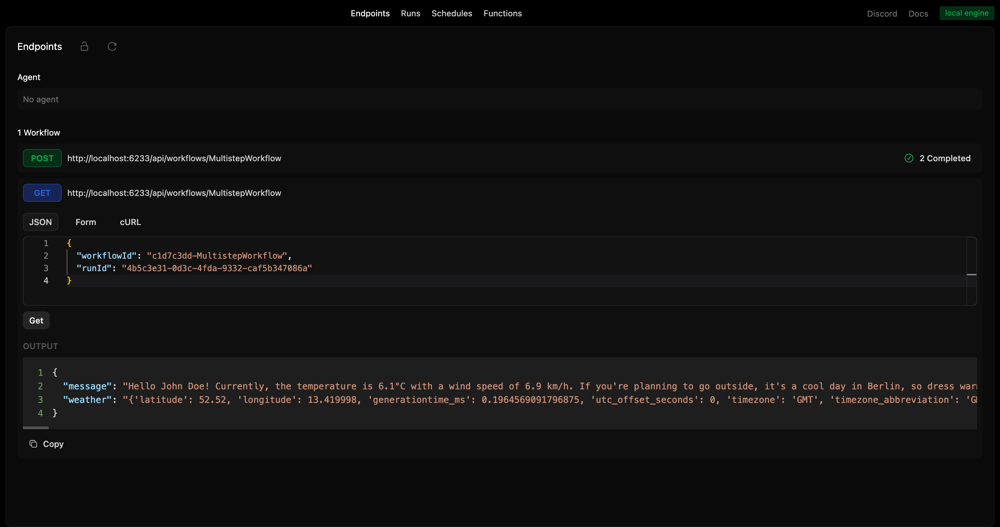
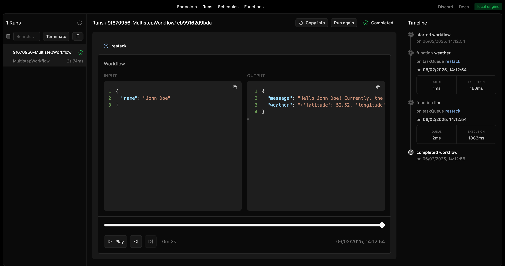

# Restack AI - Agent with third party APIs

This repository contains an agent with third party APIs
It demonstrates how to set up a multi steps workflow with Weather API and OpenAI.

## Prerequisites

- **Node 20+**

## Start Restack

To start the Restack, use the following Docker command:

```bash
docker run -d --pull always --name restack -p 5233:5233 -p 6233:6233 -p 7233:7233 -p 9233:9233 ghcr.io/restackio/restack:main
```

## Install dependencies and start services

```bash
npm install
npm run dev
```

## Run agent

### from UI

You can run workflows from the UI by clicking the "Run" button.



### from API

You can run workflows from the API by using the generated endpoint:

`POST http://localhost:6233/api/workflows/multistepWorkflow`

### from any client

You can run workflows with any client connected to Restack, for example:

If using uv:

```bash
uv run schedule-workflow
```

If using pip:

```bash
python -c "from src.schedule_workflow import run_schedule_workflow; run_schedule_workflow()"
```

executes `schedule_workflow.py` which will connect to Restack and execute the `multistepWorkflow` workflow.

## See run results

### from UI

You can see the run results in the UI.



## Deploy on Restack Cloud

To deploy the application on Restack, you can create an account at [https://console.restack.io](https://console.restack.io)
