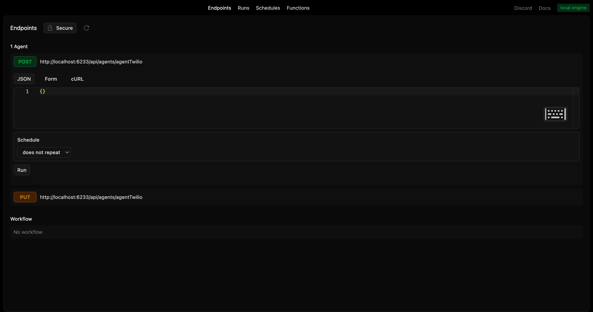
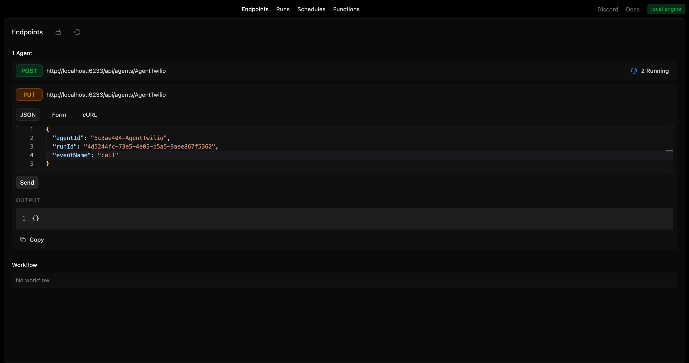
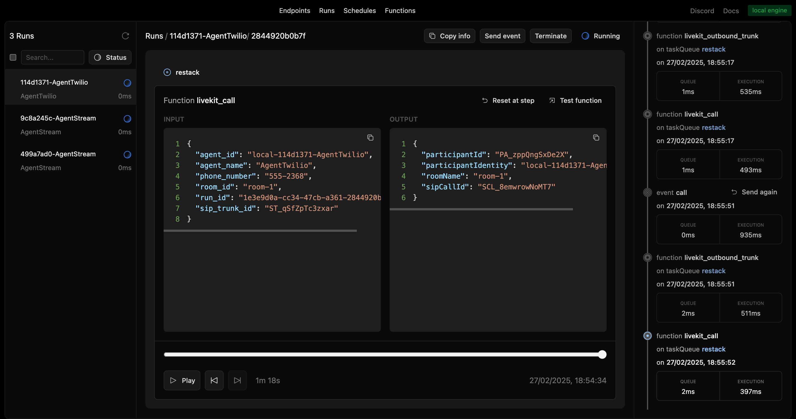

# Restack AI - Agent with telephony - Twilio

Build an AI agent that do an outbound call with Twilio and can interact with in realtime with voice.

This readme explains how to run this example.
For a complete documentation on how the agent works and how to setup the services, visit https://docs.restack.io/telephony-video-voice/telephony

## Prerequisites

- Docker (for running Restack)
- **Node 20+**
- Twilio account (for outbound calls)
- Livekit account (for WebRTC pipeline)
- Deepgram account (for transcription)
- ElevenLabs account (for TTS)

### Trunk setup for outbound calls with Twilio

In https://github.com/restackio/examples-python/tree/main/agent_telephony/twilio/livekit-trunk-setup you can find a script to create automaticlaly trunk setup on Twilio.

## Start Restack

To start the Restack, use the following Docker command:

```bash
docker run -d --pull always --name restack -p 5233:5233 -p 6233:6233 -p 7233:7233 -p 9233:9233 ghcr.io/restackio/restack:main
```

## Configure environment variables

In all subfolders, duplicate the `env.example` file and rename it to `.env`.

Obtain a Restack API Key to interact with the 'gpt-4o-mini' model at no cost from [Restack Cloud](https://console.restack.io/starter)


## Install dependencies and start services

In /agent, open a terminal and run

```bash
npm install
npm run dev
```

or with pnpm

```bash
pnpm install
pnpm run dev
```

This will start a Node.js app with Restack Services.
Your code will be running and syncing with Restack to execute agents.

In /livekit-pipeline, open a terminal and run

```bash
npm install
npm run dev
```

or with pnpm

```bash
pnpm install
pnpm run dev
```

This will start a Node.js app with Livekit Pipeline.

## Create a new Agent

### from UI

Run the agent from the UI by clicking the "Run" button for the agent "AgentTwilio".



### from API

Run the agent from the API by using the generated endpoint:

`POST http://localhost:6233/api/agents/AgentTwilio`

Restack agent will create a Livekit WebRTC room and will ask a livekit pipeline to connect to it, ready for a phone call.

## Trigger an outbound phone call

### from API

You can send events to the agent by using the following endpoint:

`PUT http://localhost:6233/api/agents/AgentTwilio/:agentId/:runId`

with the payload:

```json
{
  "eventName": "call",
  "eventInput": {
    "phoneNumber": "+XXXXXXX"
  }
}
```

to trigger an outbound phone call.

or

```json
{
  "eventName": "end"
}
```

to end the conversation with the agent.

### from any client

You can send event to the agent workflows with any client connected to Restack, for example:

Modify agentId and runId in eventAgent.ts and then run:

```bash
pnpm event-agent
```

It will also trigger an outbound call to the phone number specified in the eventInput.



## Follow the agent run

You can replay and follow the agent run in the UI.



## Deploy on Restack Cloud

To deploy the application on Restack, you can create an account at [https://console.restack.io](https://console.restack.io)
