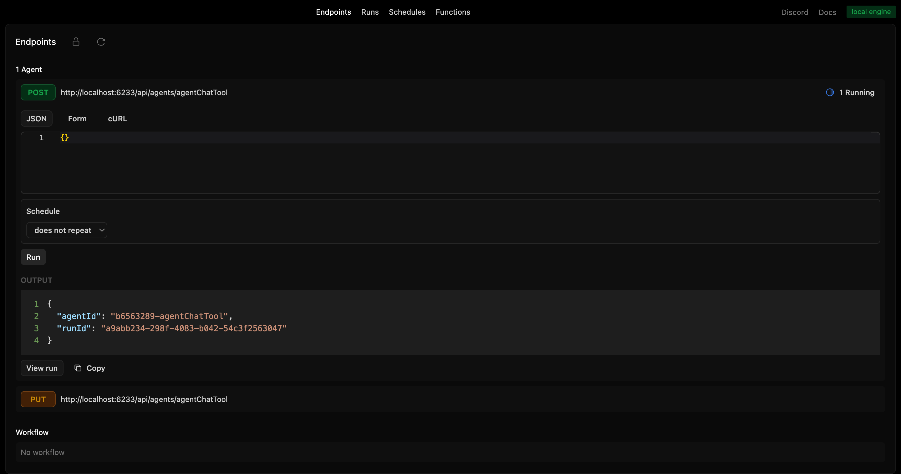
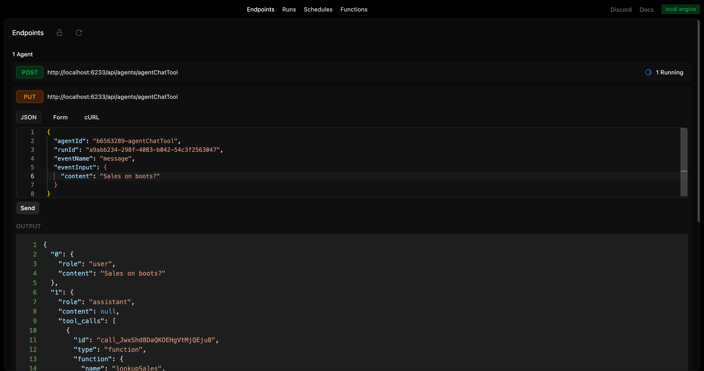
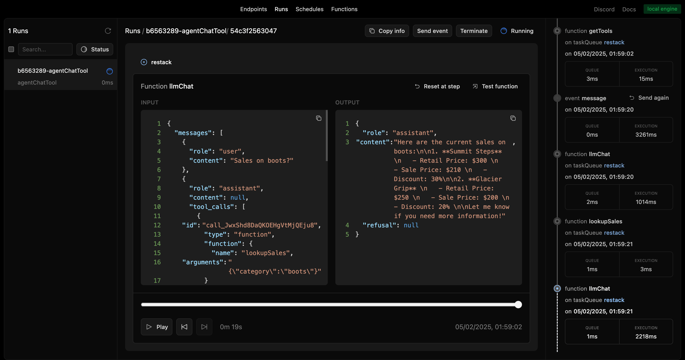

# Restack Agent with Tool Calling

A sample repository with an agent using tool calling.

## Requirements

- **Node 20+**

## Start Restack

To start Restack, use the following Docker command:

```bash
docker run -d --pull always --name restack -p 5233:5233 -p 6233:6233 -p 7233:7233 -p 9233:9233 ghcr.io/restackio/restack:main
```

## Install dependencies and start services

```bash
npm install
npm run dev
```

This will start a Node.js app with Restack Services.
Your code will be running and syncing with Restack to execute agents.

## Run agents

### from UI

You can run agents from the UI by clicking the "Run" button.



### from API

You can run agents from the API by using the generated endpoint:

`POST http://localhost:6233/api/agents/agentChatTool`

### from any client

You can run agents with any client connected to Restack, for example:

```bash
npm run schedule
```

executes `scheduleAgent.ts` which will connect to Restack and execute the `agentChatTool` agent.

## Send events to the Agent

### from UI

You can send events like message or end from the UI.



And see the events in the run:



### from API

You can send events to the agent by using the following endpoint:

`PUT http://localhost:6233/api/agents/agentChatTool/:agentId/:runId`

with the payload:

```json
{
  "eventName": "message",
  "eventInput": { "content": "Sales on boots?" }
}
```

to send messages to the agent.

or

```json
{
  "eventName": "end"
}
```

to end the conversation with the agent.

### from any client

You can send event to the agent with any client connected to Restack, for example:

Modify agentId and runId in eventAgent.ts and then run:

```bash
npm run event
```

It will connect to Restack and send 2 events to the agent, one to generate another agent and another one to end the conversation.

## Deploy on Restack Cloud

To deploy the application on Restack, you can create an account at [https://console.restack.io](https://console.restack.io)
