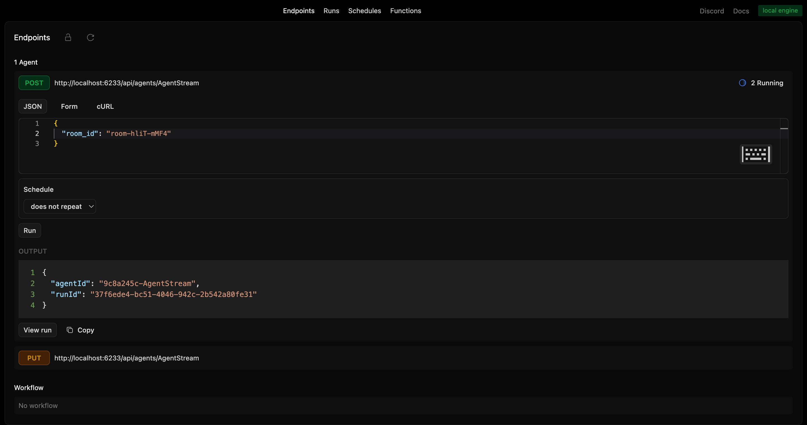
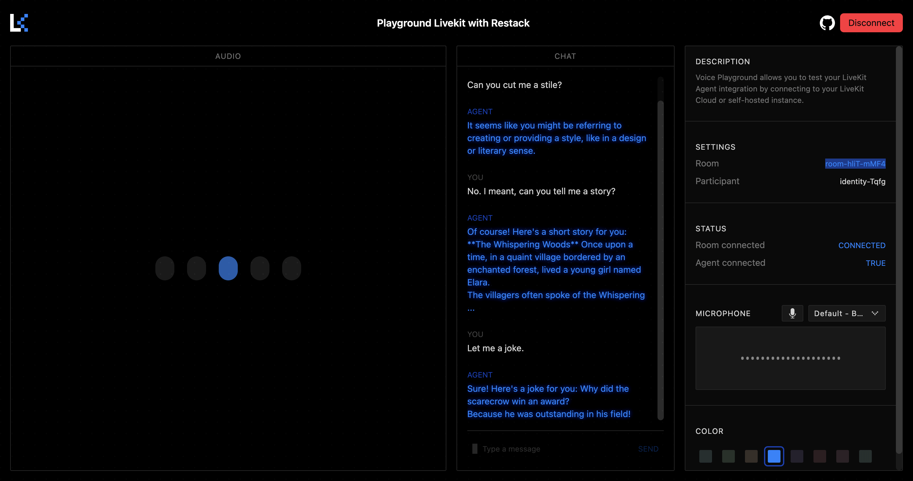
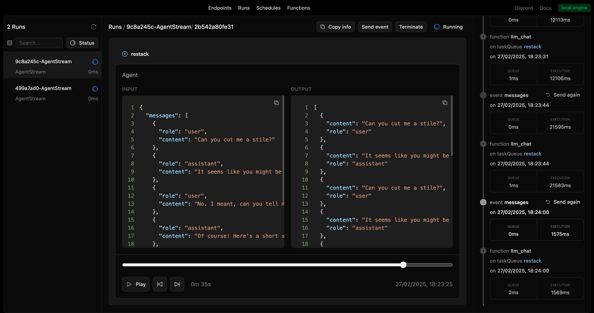

# Restack AI - Agent with Voice

Build an AI agent that users can interact with in realtime with voice.

## Prerequisites

- Docker (for running Restack)
- **Node 20+**
- Deepgram account (For speech-to-text transcription)
- ElevenLabs account (for text-to-speech and voice cloning)

## Start Restack

To start the Restack, use the following Docker command:

```bash
docker run -d --pull always --name restack -p 5233:5233 -p 6233:6233 -p 7233:7233 -p 9233:9233 ghcr.io/restackio/restack:main
```

## Start Restack Agent with Stream

### Install dependencies and start services

at /agent-voice/livekit/agent-stream/

```bash
npm install
npm run dev
```

This will start a Node.js app with Restack Services.
Your code will be running and syncing with Restack to execute agents.


## Start Livekit voice pipeline

at /agent-voice/livekit/livekit-pipeline/

### Install dependencies and start services

```bash
npm install
npm run dev
```

This will start a Node.js app with Restack Services.
Your code will be running and syncing with Restack to execute agents.


## Configure Your Environment Variables

Duplicate the `env.example` file and rename it to `.env`.

Obtain a Restack API Key to interact with the 'gpt-4o-mini' model at no cost from [Restack Cloud](https://console.restack.io/starter)


## Interact in realtime with the agent

Run the Livekit Agents Playground:

https://github.com/livekit/agents-playground

Modify your .env in https://github.com/livekit/agents-playground/blob/main/.env.example

Run the following commands:
```bash
npm run install
```

```bash
npm run dev
```

Open the Livekit Agents Playground:

http://localhost:3000/

Connect and copy the **room_id**

Open Restack Engine:

http://localhost:5233/

Create a new agent with room_id from Livekit Agents Playground.

## Create a new Agent

### from UI

Run the agent from the UI by clicking the "Run" button for the agent "agentVoice".



### from API

Run the agent from the API by using the generated endpoint:

`POST http://localhost:6233/api/agents/agentVoice`

with input:

```json
{
  "room_id": "room_id"
}
```

## Talk to the agent

The Livekit pipleine worker will connect to the room and you can start talking to the agent.




## Follow the agent run

You can replay and follow the agent run in the UI.



## Deploy on Restack Cloud

To deploy the application on Restack, you can create an account at [https://console.restack.io](https://console.restack.io)
