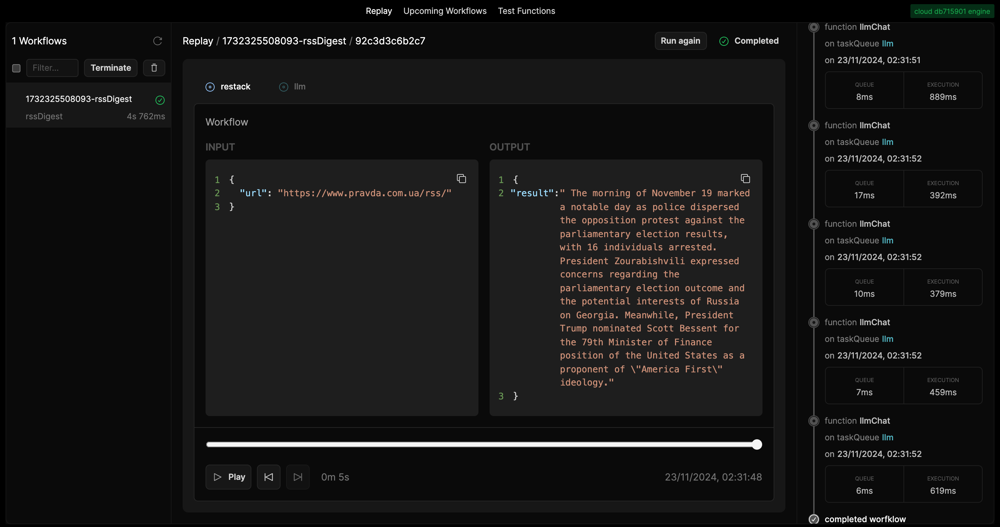
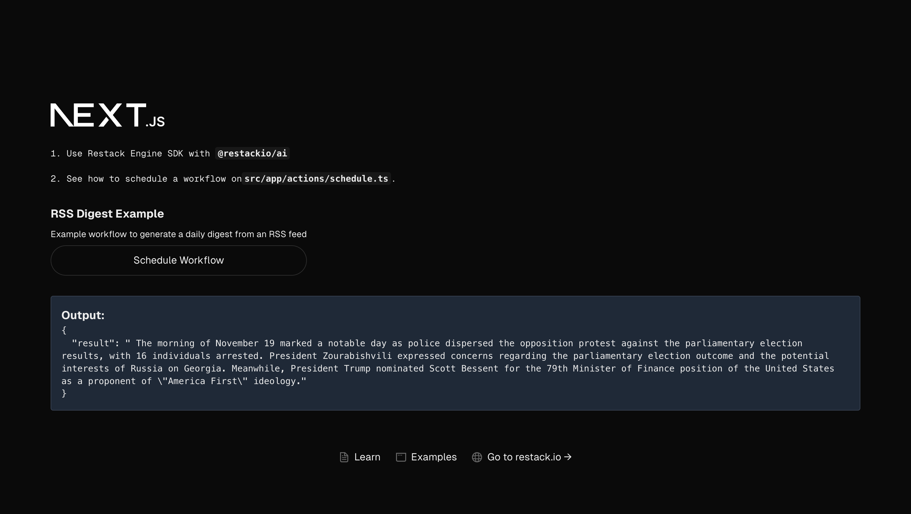

# Quickstart: War news scraper & summarizer - USS Hornet Defense Tech Hackathon

This project demonstrates how to build a Next.js application that scrapes and summarizes defense news articles using OpenBabylon AI. Built for the USS Hornet Defense Tech Hackathon, it features a Next.js frontend for displaying summarized news and a backend service that handles RSS feed scraping, content translation, and AI-powered summarization of defense-related articles.

## OpenBabylon Credentials

During the hackathon, OpenBabylon provides a public url. No API key is needeed.

```
OPENBABYLON_API_URL=64.139.222.109:80/v1
```

## Functions

A core feature of Restack is the ability to build [TypeScript functions](https://docs.restack.io/libraries/typescript/functions) that can be executed as workflow steps. Each function supports rate limiting, retries, error handling and replay capabilities.

1. **rssPull**: Fetches and parses RSS feeds with encoding detection, supporting multiple RSS formats and character encodings
2. **crawlWebsite**: Extracts clean article content from web pages using Mozilla's Readability
3. **splitContent**: Splits large texts into manageable chunks (4096 token limit)
4. **llmChat**: Integrates with OpenBabylon's Mistral model for translation and summarization

## Example Workflow

Functions can be executed as steps in a [workflow](https://docs.restack.io/features/workflows). The example includes one main workflow:

**rssDigest**: Multi-stage workflow that:

- Fetches RSS feeds from specified sources (default: pravda.com.ua)
- Crawls full article content
- Splits content into manageable chunks
- Translates content to English
- Generates per-chunk summaries
- Creates a final consolidated digest

## Project Structure

- `frontend/`: Next.js frontend application with:

  - Server Actions for workflow triggering
  - Tailwind CSS styling
  - Type-safe API integration to Restack Engine

- `backend/`: Restack backend with Node.js featuring:
  - `rssDigest` workflow
  - `llmChat` function to OpenBabylon Endpoint

## Prerequisites

- Node.js
- Docker
- OpenBabylon AI API URL (No API KEY NEEDED)
- Restack Engine local

## Getting Started

### 1. Install Restack Web UI & Engine on local

First, install the Restack Web UI and Engine using Docker:

```bash
docker run -d --pull always --name restack -p 5233:5233 -p 6233:6233 -p 7233:7233 -p 9233:9233 ghcr.io/restackio/restack:main
```

- Required for any function and workflow execution as the orchestration layer
- Access the Web UI at http://localhost:5233 to monitor workflow runs, view logs, and manage functions



### 2. Set Up Backend with Restack AI

1. Navigate to the backend directory:

```bash
cd backend
```

2. Install dependencies:

```bash
pnpm install
```

3. Create a `.env` file with your credentials in the backend folder:

```
# (Required) Example-specific environment variables

OPENBABYLON_API_URL=<OPENBABYLON_API_URL>

# (Optional) Restack Cloud - You only need to set these if you are using Restack Cloud.

# Do not forget to add the port :433
RESTACK_ENGINE_ADDRESS=<RESTACK_ENGINE_ADDRESS:443>
RESTACK_ENGINE_ID=<RESTACK_ENGINE_ID>
RESTACK_ENGINE_API_KEY=<RESTACK_ENGINE_API_KEY>
RESTACK_CLOUD_TOKEN=<RESTACK_CLOUD_TOKEN>
```

4. Start the backend service:

```bash
pnpm run dev
```

### 3. Set Up Frontend

1. Navigate to the frontend directory:

```bash
cd frontend
```

2. Install dependencies:

```bash
pnpm install
```

3. Create a `.env` file:

```
# (Required) Example-specific environment variables

OPENBABYLON_API_URL=<OPENBABYLON_API_URL>

# (Optional) Restack Cloud - You only need to set these if you are using Restack Cloud.

# Do not forget to add the port :433
RESTACK_ENGINE_ADDRESS=<RESTACK_ENGINE_ADDRESS:443>
RESTACK_ENGINE_ID=<RESTACK_ENGINE_ID>
RESTACK_ENGINE_API_KEY=<RESTACK_ENGINE_API_KEY>
RESTACK_CLOUD_TOKEN=<RESTACK_CLOUD_TOKEN>
```

4. Start the development server:

```bash
pnpm run dev
```

Visit [http://localhost:3000](http://localhost:3000) to see the application.



## Deploy on Restack Cloud

To deploy the application on Restack, you can create an account at [Restack Console](https://console.restack.io)
