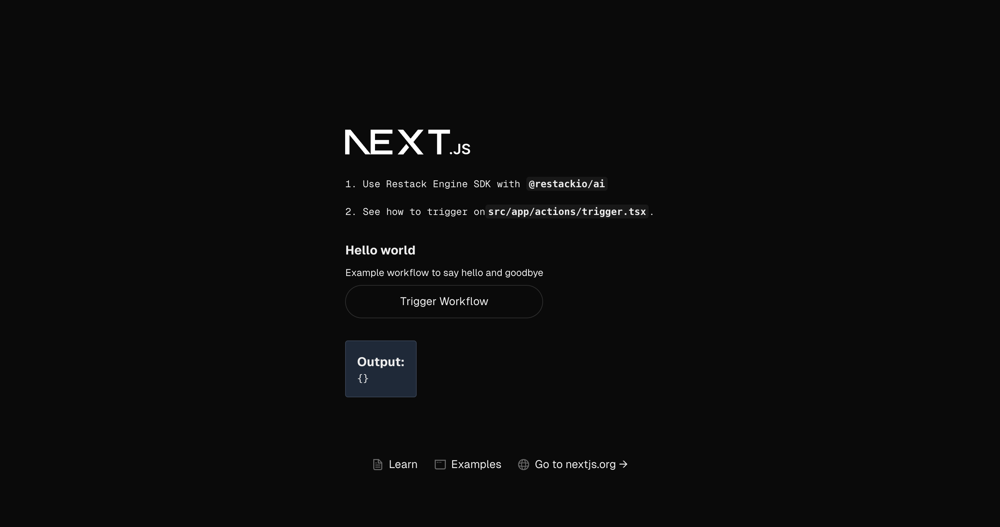
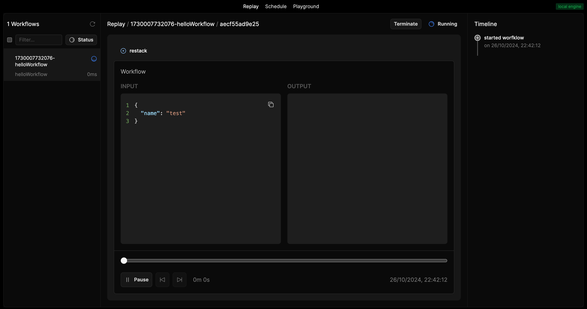

This is a [Next.js](https://nextjs.org) project bootstrapped with [`create-next-app`](https://nextjs.org/docs/app/api-reference/cli/create-next-app).

## Getting Started

First, run the development server:

```bash
npm run dev
# or
yarn dev
# or
pnpm dev
# or
bun dev
```

Open [http://localhost:3000](http://localhost:3000) with your browser to see the result.

You can start editing the page by modifying `app/page.tsx`. The page auto-updates as you edit the file.

This project uses [`next/font`](https://nextjs.org/docs/app/building-application/optimizing/fonts) to automatically optimize and load [Geist](https://vercel.com/font), a new font family for Vercel.

# Install Restack Web UI 

To install the Restack Web UI, you can use Docker.
```
docker run -d --pull always --name restack -p 5233:5233 -p 6233:6233 -p 7233:7233 -p 9233:9233 ghcr.io/restackio/restack:main
```
# Schedule Restack workflow from NextJS frontend

The example is a NextJS application with front and backend. You can schedule the workflow example from the user interface. 



When the client successfully schedules the workflow, you can see the started workflow in the Restack Web UI. You should see the following screen:



Now you can add a backend to the example. In other examples, you can see how to ideally structure the backend app with workflows, functions and services.

