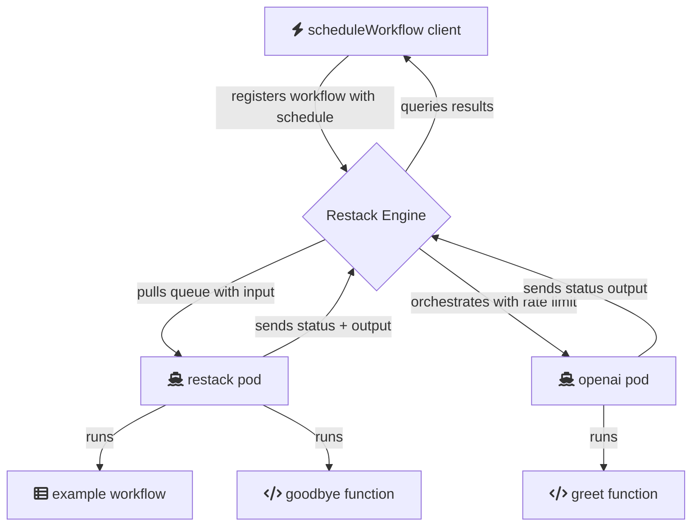

# Requirements

- Node 20 or higher

```bash
brew install nvm
nvm use 20
```

# Install Restack Web UI

To install the Restack Web UI, you can use Docker.

```
docker run -d --pull always --name restack -p 5233:5233 -p 6233:6233 -p 7233:7233 -p 9233:9233 ghcr.io/restackio/restack:main
```

# Start services

Where all your code is defined, including workflow steps.

add OPENAI_API_KEY in .env

```bash
npm i
npm run build
npm run dev
```

Your code will be running and syncing with Restack engine to execute workflows or functions.

This will start a 'restack' service for workflows and functions, and an 'openai' service for OpenAI functions.

# Schedule a workflow

In another shell:

```bash
npm schedule
```

Will schedule to start example workflow immediately. Learn more about [workflows](https://docs.restack.io/features/workflows)

# Architecture



## Deploy on Restack

For more detailed information on deploying your repository to Restack, refer to the [Restack Cloud deployment documentation](https://docs.restack.io/restack-cloud/deployrepo).
