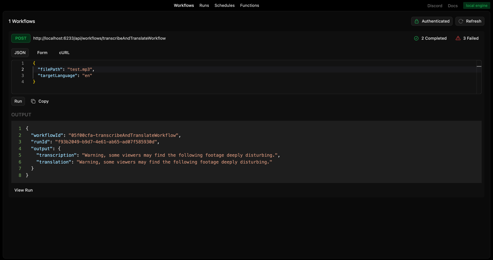

# Overview

This example showcases how transcribe an audio file and then translate text to a target language. You can use any mp3 file you have at your disposal to test the example. An example test.mp3 file is already provided and can be used when running the workflow.

# Restack Quickstart

A sample repository with a simple greeting workflow.

## Requirements

- **Node 20+**

## Start Restack

To start Restack, use the following Docker command:

```bash
docker run -d --pull always --name restack -p 5233:5233 -p 6233:6233 -p 7233:7233 -p 9233:9233 ghcr.io/restackio/restack:main
```

## Install dependencies and start services

```bash
npm install
npm run dev
```

This will start a Node.js app with Restack Services.
Your code will be running and syncing with Restack to execute workflows or functions.

## Run workflows

### from UI

You can run workflows from the UI by clicking the "Run" button.



### from API

You can run workflows from the API by using the generated endpoint:

`POST http://localhost:6233/api/workflows/transcribeAndTranslate`

with the payload:

```json
{
  "filePath": "test.mp3",
  "targetLanguage": "en"
}
```

### from any client

You can run workflows with any client connected to Restack, for example:

```bash
npm schedule-workflow
```

executes `scheduleWorkflow.ts` which will connect to Restack and execute the `transcribeAndTranslate` workflow.

## Deploy on Restack Cloud

To deploy the application on Restack, you can create an account at [https://console.restack.io](https://console.restack.io)
